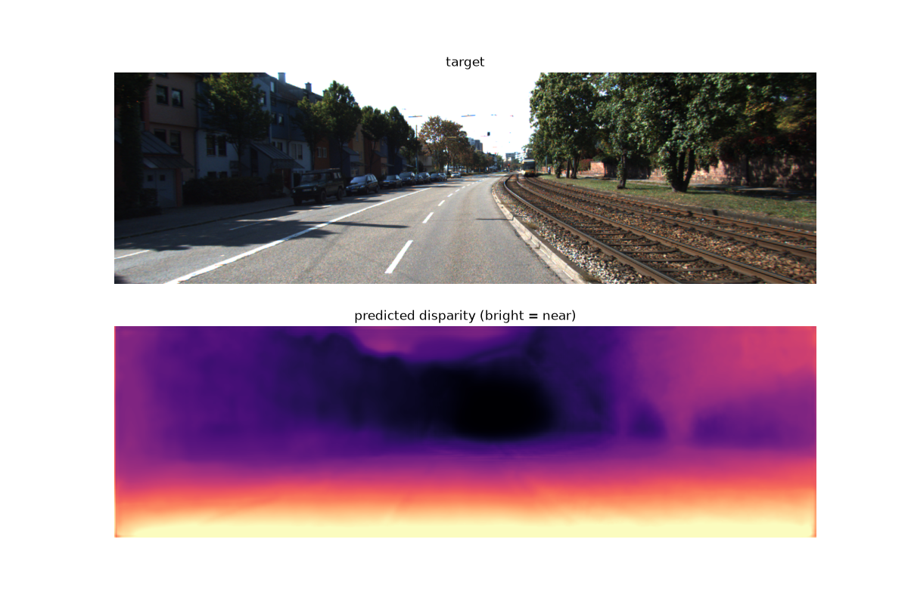
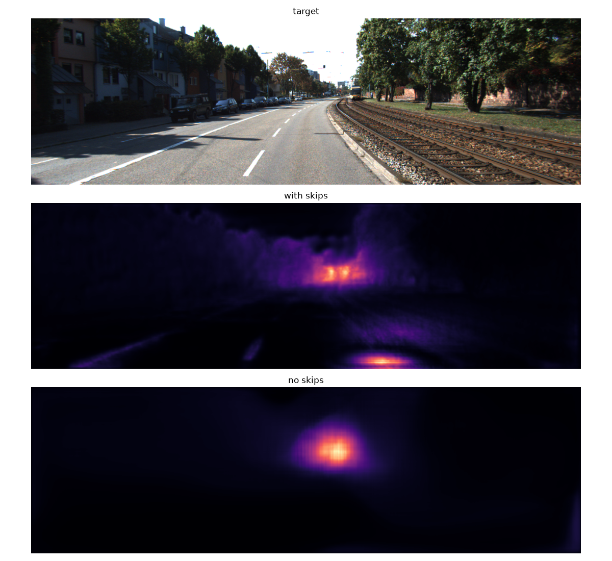
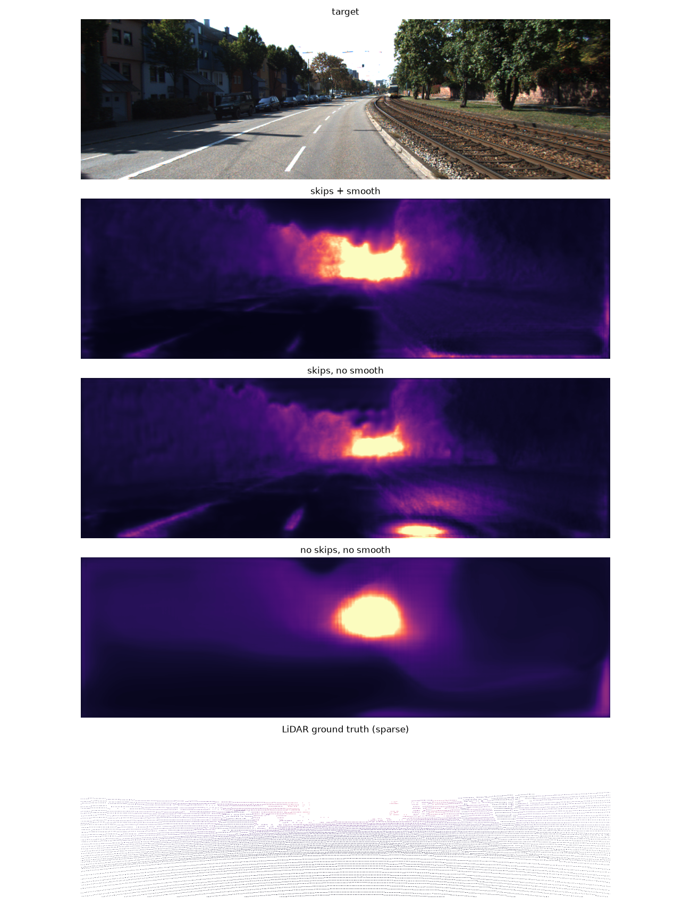
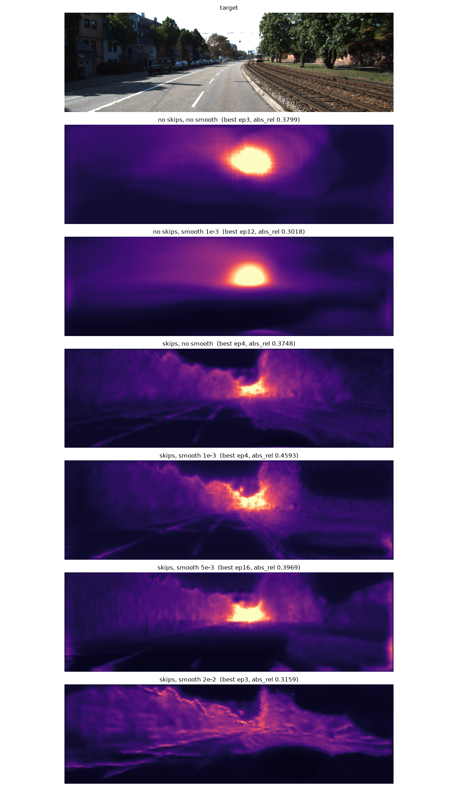

# Self-Supervised Monocular Depth Estimation - Reproduction

A from-understanding reproduction of self-supervised monocular depth estimation on KITTI. I'm building this to learn the geometry that underlies visual depth and SLAM - pixel backprojection, camera pose, and the photometric reprojection loss.

**Status:** In progress — active learning project. Starte 08.04.2026;

## Papers this is based on

- R. Garg, V. Kumar B G, G. Carneiro, I. Reid — *Unsupervised CNN for Single View Depth Estimation: Geometry to the Rescue* (ECCV 2016)
- C. Godard, O. Mac Aodha, G. Brostow — *Unsupervised Monocular Depth Estimation with Left-Right Consistency* (CVPR 2017)
- C. Godard, O. Mac Aodha, M. Firman, G. Brostow — (Monodepth2, ICCV 2019)

## Running it

```bash
scripts/download_kitty.sh
uv sync
uv run warp.py
```

Everything is in `warp.py`. Settings are constants at the top (`EPOCHS`, `NUM_SCALES`, `SMOOTHNESS_WEIGHT`, `AUTOMASK`). Each epoch prints the seven KITTI metrics. Outputs are `depth_net_best.pt` and `assets/depth_result.png`.

## Results

333 triplets from three `2011_09_26` drives, 192×640, pretrained ResNet18, 40 epochs.

| Model                               | abs_rel | rmse | δ < 1.25 |
| ----------------------------------- | ------- | ---- | --------- |
| Monodepth2 (paper,`mono_640x192`) | 0.115   | —   | 0.877     |
| This repo (single-scale)            | 0.146   | 5.90 | 0.829     |
| This repo (multi-scale)             | 0.153   | 5.57 | 0.819     |



Not directly comparable to the paper: my evaluation is in-sample (all three drives are trained on), and I train on 333 triplets against their 39,810. Metrics use per-frame median scaling, Garg crop, 80m cap, over 113 frames.

## Notes / what I learned

### One loss became three

I started with only the photometric loss (L1 + SSIM): warp the next frame onto the target, compare. It is badly under-constrained on its own. Each later term fixes something it cannot see.

- **Smoothness.** The photometric gradient at a pixel comes from the image gradient at the sampled point. On road, blank walls and sky that gradient is ~0, so those pixels get no gradient at all and their depth drifts freely. Smoothness constrains exactly them, and switches off across image edges so depth can still jump at object boundaries.
- **Min-reprojection + auto-masking.** Averaging over `t-1` and `t+1` gives wrong gradients wherever a pixel is occluded in one of them. Taking the per-pixel minimum lets the frame that can see it win. Auto-masking puts the unwarped sources into that same minimum, so pixels better explained by no motion contribute nothing.

### Skips

The first decoder upsampled from the 1/32 bottleneck with no skips, so it could not physically draw an edge sharper than ~32px. Every early depth map was a blob, whatever else I changed.

Skips fixed that, and on their own made the metric worse: 0.4418 → 0.9229.



The detail is real - tree line, railway texture - but wrong, most visibly a bright streak on near asphalt predicted as far away. The old bottleneck had been an accidental regularizer: it could not draw a wrong sharp edge because it could not draw any sharp edge.

### Smoothness

Adding smoothness to the skip model recovered most of the damage, 0.9229 → 0.5717, and the asphalt streak disappears.



The term is `|∂d| · e^(−|∂I|)` on mean-normalized disparity. Flat image → full smoothing. Strong edge → penalty off. The mean-normalization is not optional: without it you can just shrink all disparities toward zero (verified — ×0.01 drops the raw loss 100×, leaves the normalized one unchanged).

Across a 6-config sweep, every unsmoothed run ended at 0.80–1.01 and every smoothed run at 0.40–0.52. No overlap.



### Auto-masking

This is where training became stable. Before it, `abs_rel` bounced between 0.30 and 2.56 from epoch to epoch. After, the curve was clean: 0.549 → 0.287 in 10 epochs.

On a static scene the gradient is exactly `0.000e+00` with masking on and `1.849e-02` with it off, so those pixels are fully excluded. That kills the infinite-depth degenerate solution.

### Multi-scale

Each scale's disparity is upsampled to full resolution *before* warping, so every scale aims at the same target instead of each solving its own low-res problem (which causes holes and texture-copy).

No measurable gain here: 0.146 → 0.153. It fixes artifacts that sparse LiDAR points can't see, and at 333 images those aren't the bottleneck.

### Evaluate on many frames

I evaluated on a single frame for too long. A whole 6-config ablation came back unreadable because epoch-to-epoch noise was 10× larger than the differences between configs. Moving to 113 frames fixed it. Should have built this first.

### What I got wrong

I predicted more epochs would plateau around 0.20–0.25; it reached 0.146 and was still improving at epoch 38 of 40. I also suspected the final map was a degenerate ground plane, but a row-only model explains 0.643 of the prediction and 0.789 of the LiDAR truth - the scene really is mostly a vertical ramp.

## License & attribution

Baseline code adapted from `nianticlabs/monodepth2`, © Niantic Inc. 2019, released for non-commercial research use — their license header and attribution are retained wherever their code is used. The KITTI dataset is used under its CC BY-NC-SA terms. If you build on this, please cite the papers listed above.
